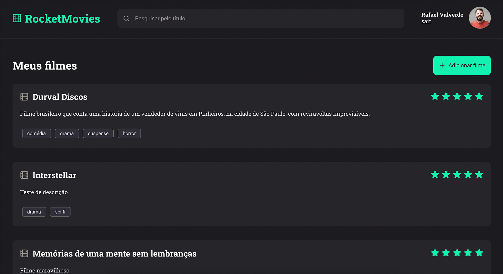

<h1 align="center">Curso Explorer Stage 10 - RocketSeat - Projeto RocketMovies</h1>

Projeto desenvolvido no curso Explorer da Rocketseat, de uma aplicação CRUD, com cadastro de usuário, login, cadastros de filmes e manipulação de banco de dados, em uma SPA (Single Page Application) construída com React.js e Node.js.

<!-- 

Veja o resultado <a href="" target="_blank">aqui.</a>

 -->

  <a href="#-tecnologias">Tecnologias</a>&nbsp;&nbsp;&nbsp;|&nbsp;&nbsp;&nbsp;
  <a href="#-projeto">Projeto</a>&nbsp;&nbsp;&nbsp;|&nbsp;&nbsp;&nbsp;
  <a href="#-layout">Layout</a>&nbsp;&nbsp;&nbsp;|&nbsp;&nbsp;&nbsp;
  <a href="#memo-licença">Licença</a>

  

 

  

## 🚀 Tecnologias

Esse projeto foi desenvolvido com as seguintes tecnologias:

- Figma
- React.js
- Node.js
- HTML e CSS
- JavaScript
- Git e Github

## 💻 Projeto

Uma aplicação em React.js e Node.js para cadastro e organização de filmes, com rating, descrições, tags, além de criação de usuários, login e update de profile.

## 🔖 Layout

Você pode visualizar o layout do projeto através [DESSE LINK](https://www.figma.com/design/eaIHxqQ8KoOWlTw3Md7GX2/RocketMovies?node-id=0%3A1&t=idj3W4C4xTKiLsCu-1). É necessário ter conta no [Figma](https://figma.com) para acessá-lo.

## :memo: Licença

Esse projeto está sob a licença MIT.

---

Feito com ♥ by Rocketseat/[rafaverde](https://github.com/rafaverde) :wave: [Participe da nossa comunidade!](https://discord.gg/rocketseat)

#Rocketmovies #RocketSeat
